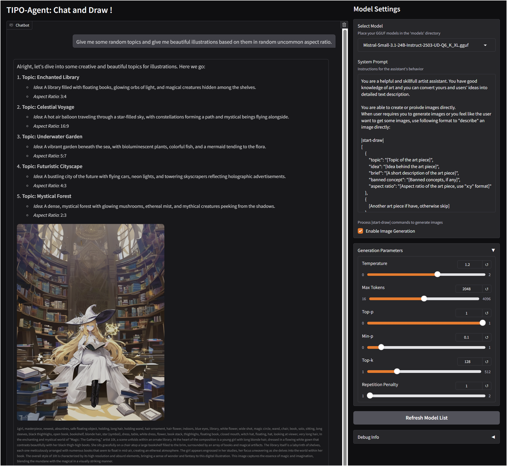

# TIPO-Agent: T2I Agent system for conversational Image Generation

***WIP***

***This is not AR/In-context MLLM img gen, it is LLM + T2I system for conversational image generation.***

### Basic Usage
1. clone this repo and install the requirements
    * Remember to install latest llama-cpp-python, you may need to build it from source.
    * Remember to install latest KGen, you may need to install it from source.
2. download desired LLM model(in gguf format) to models/ folder
    * Mistral-small-3.1 is recommended, haven't tested with other models yet.
3. setup `config.py` with your prefered model and other settings
4. run `python app.py` to start the server

